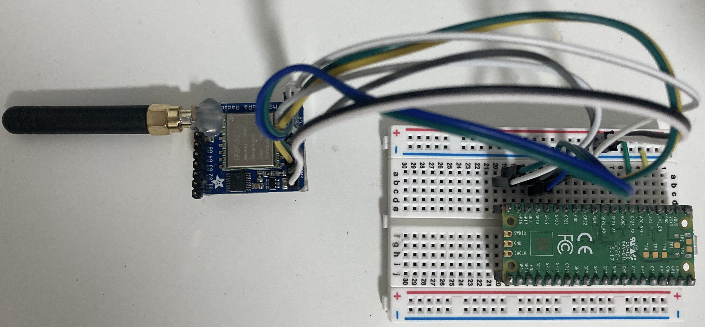
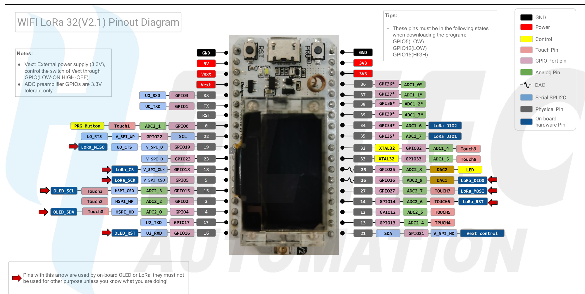
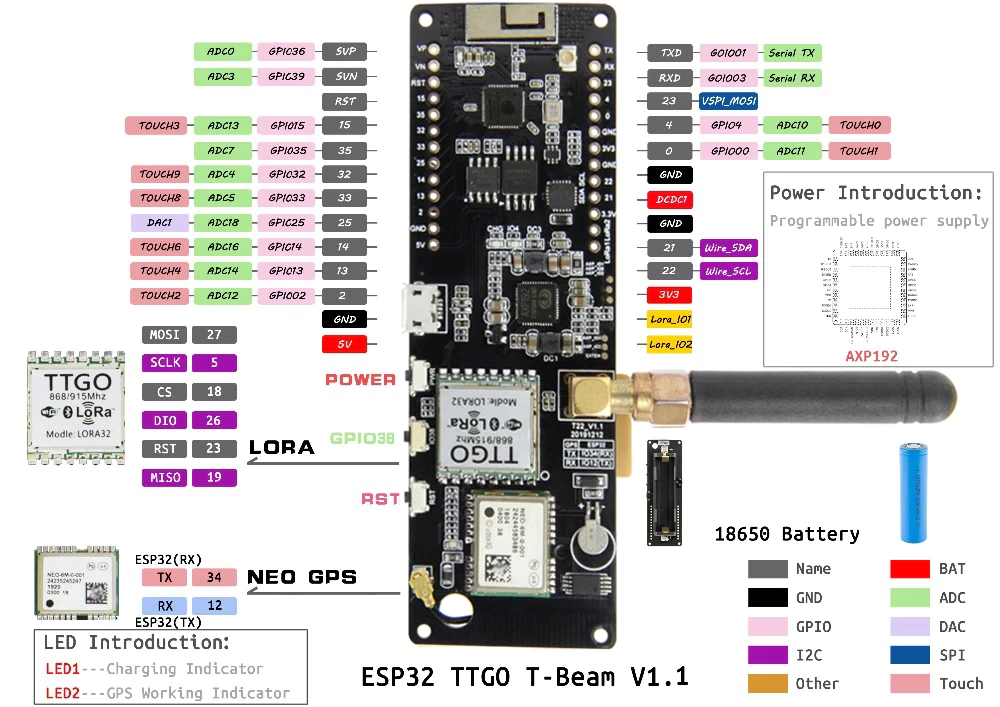
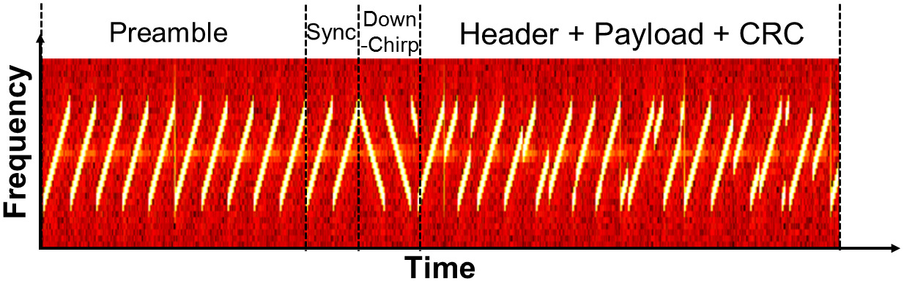
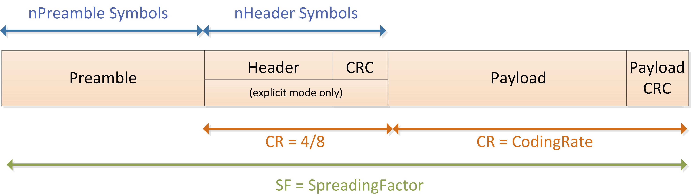
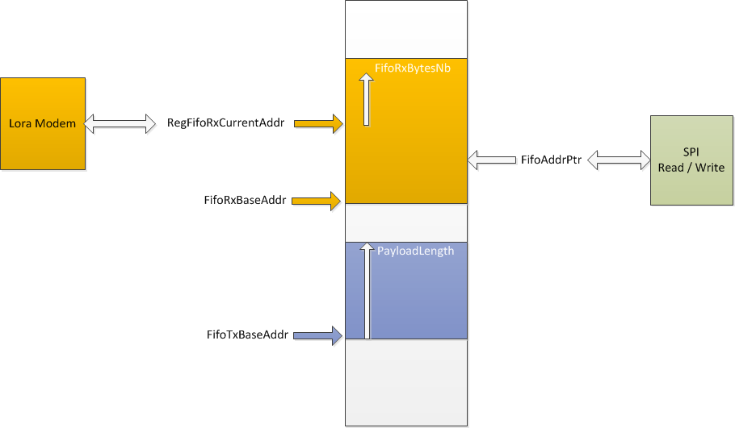

### Overview
* This repo will provide MicroPython codes for basic Tx transmittion and Rx reception.
* SX1276 is a LoRa modem that can send or receive data over a long distance.
* Adafruit created a standalone breakout: Adafruit RFM95W 
    * Example code is for RFM95W with the help of Raspberry Pi Pico
* Many ESP32 LoRa development boards are using this modem: Heltec WiFi LoRa 32 V2, TTGO T-Beam V1.1 
    * Example code can drive the on-board modem after GPIO remapping
* One key thing is they all use SPI as the control interface of LoRa modem.
* SPI pins on RFM95W are exposed so we can hook it up with Raspberry Pi Pico while pins are marked on other two ESP32 LoRa development boards.
### See the wiring
* Wiring RFM95W with Pico<br/>
   * We decide which GPIO we want to use
   ```
    # RFM95W         Pico GPIO
    LoRa_MISO_Pin  = 16
    LoRa_CS_Pin    = 17
    LoRa_SCK_Pin   = 18
    LoRa_MOSI_Pin  = 19
    LoRa_G0_Pin    = 20 # DIO0_Pin
    LoRa_EN_Pin    = 21
    LoRa_RST_Pin   = 22
    SPI_CH         =  0
   ```
 </img>
* Heltec WiFi LoRa 32 V2<br/>
   * Predefined (see the pinout)
   ```
    LoRa_MISO_Pin = 19
    LoRa_MOSI_Pin = 27
    LoRa_SCK_Pin  =  5
    LoRa_CS_Pin   = 18
    LoRa_RST_Pin  = 14
    LoRa_DIO0_Pin = 26
    LoRa_DIO1_Pin = 35
    LoRa_DIO2_Pin = 34
    SPI_CH        =  1
   ```
 </img>
* TTGO T-Beam V1.1<br/>
   * Predefined (see the pinout)
   ```
    LoRa_MISO_Pin = 19
    LoRa_MOSI_Pin = 27
    LoRa_SCK_Pin  =  5
    LoRa_CS_Pin   = 18
    LoRa_RST_Pin  = 23
    LoRa_DIO0_Pin = 26
   ```
 </img>
### How to use SX1276
* Enable the module if use Adafruit RFM95W (No enable pin on other ESP32 development boards so they are always enabled)
* Configure SPI communication to control the LoRa modem
* Choose LoRa Modem other than FSK/OOK Modem
* Set parameters: bandwidth (bw, Following waterfall diagram is what the signal out of LoRa modem looks like, I might provide a theoretical tutorial in the future), coding rate (CR), header mode, spreading factor (SF), syncword, preamble length, frequency, amplifier.
* Set an interrupt routine service to read incoming message and to monitor modem's working status
* Write FIFO data buffer when transmit and read when receive.
### Packet Structure
* Waterfall diagram that shows the physical representation of modulated signal.
</img>
* Header (exists in explicit mode): Payload length, payload's coding rate
* Explicit header's coding rate is 4/8 and payload's could be different (Tx tells Rx which CR Tx uses).
* SF is for whole packet
</img>
### 4.1.2. LoRa ® Digital Interface
* The LoRa ® modem comprises three types of digital interface,
  * static configuration registers
  * status registers
  * a 256-byte user-defined FIFO data buffer
* We control the modem through this digital interface
  * Practically, we read/write modem's registers via SPI protocol so we can configure its parameters (static configuration registers), get status, send or receive data (buffer registers).
### FIFO Buffer
</img>
* In order to write packet data into FIFO user should:
  1. Set register RegFifoAddrPtr's content to *RegFifoTxBaseAddr (register RegFifoTxBaseAddr's content).
  2. Write *RegPayloadLength bytes to the FIFO (RegFifo)
* In order to read packet data from FIFO user should:
  1. Set RegFifoAddrPtr to *RegFifoRxCurrentAddr.
  2. Read RegRxNbBytes from RegFifo
### Jargon in [Datasheet](DS_SX1276-7-8-9_W_APP_V7.pdf)
* RF: Radio Frequency
* RFI: RF Input
* RFO: RF Output
* { HF: {Band 1: ~915MHz}, LF: {Band 2: ~433MHz, Band 3: ~150MHz} }
* PA: Power Amplifier
* Three amplifiers: RFO_LF, RFO_HF, PA_BOOST
* PA_HP: High Power
* PA_HF and PA_LF are high efficiency amplifiers
* AFC: automatic frequency correction
* RFOP: RF output power
### Data Transmission Sequence (Figure 9)
* Change to Standby mode so the modem initiate everything
* Start Tx loop
  * Prepare payload to Tx
  * Fill FIFO data buffer with payload
  * Change to Tx mode
  * Wait for TxDone IRQ
    * In ISR, do something and clear IRQ Flags
  * Fall back to Standby mode automatically
### Continous Mode Data Reception Sequence (Figure 10)
* Change to Standby mode so the modem initiate everything
* Change to Rx Continuous mode
* Wait for IRQ (RxDone and ValidHeader/PayloadCrcError)
  * In ISR, Read FIFO data buffer to get payload
* Next IRQ
### Follow code to learn SX1276
* Use Rasberry Pi Pico and Adafruit RFM95W as the learning platform
* [How to](https://github.com/xg590/IoT/tree/master/MicroPython#add-micropython-to-raspberry-pi-pico-hello-world) run MicroPython on Rapsberry Pi Pico
* [Tx](SX1276_Tx.py) and [Rx](SX1276_Rx.py) MicroPython codes are commented extensively for learning   
* Thanks [martynwheeler/u-lora](https://github.com/martynwheeler/u-lora) and thanks [jgromes](https://github.com/jgromes/RadioLib/issues/347)
